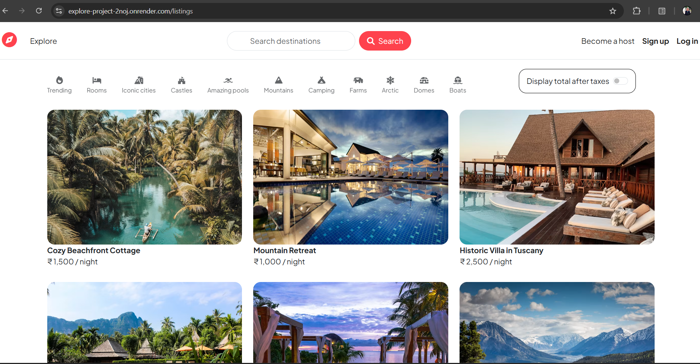
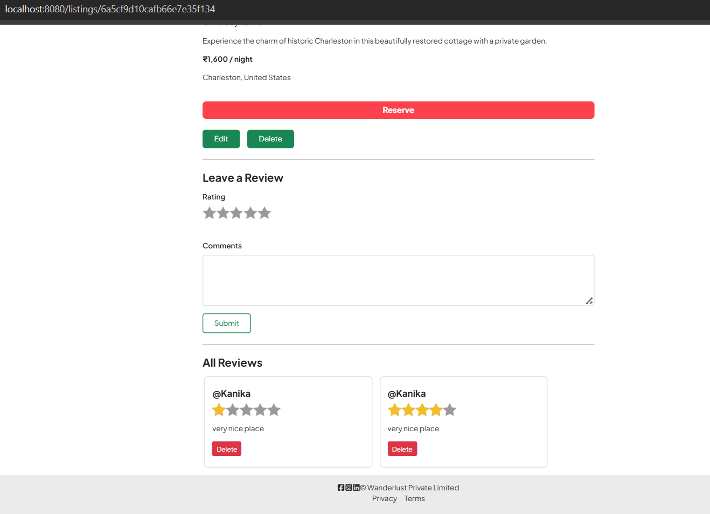
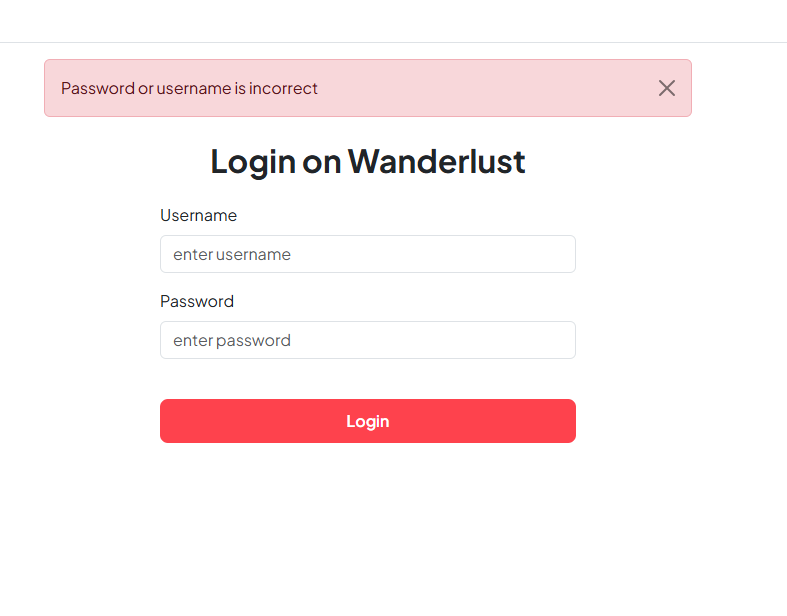
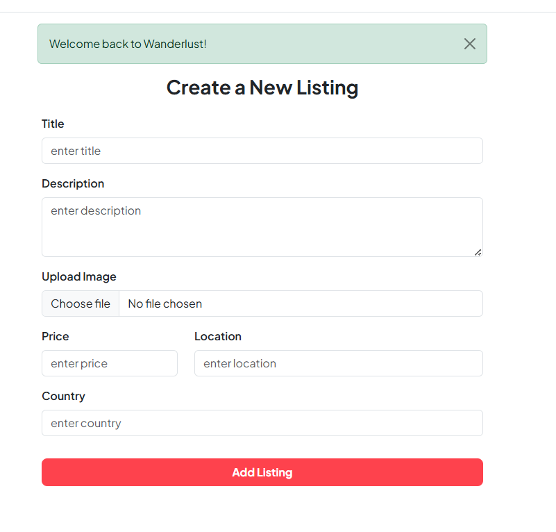

# Wanderlust 🌍

Wanderlust is a full-stack, responsive vacation rental web application inspired by Airbnb. It enables users to explore rental properties, manage custom listings, upload media assets, and leave interactive reviews—all secured with user authentication and robust backend validation.

---

## 🌐 Live Demo & Repository

- **Live Application:** [https://explore-project-2noj.onrender.com/](https://explore-project-2noj.onrender.com/)
- **GitHub Repository:** [https://github.com/Kanika-Agarwal2/Wanderlust-Project](https://github.com/Kanika-Agarwal2/Wanderlust-Project)

---

## 📷 Interface Previews

| **Listings Home Page** | **Property Details & Reviews** |
| :---: | :---: |
|  |  |

| **User Authentication (Login & Signup)** | **Create Listing (Cloudinary Upload)** |
| :---: | :---: |
|  |  |

---

## ✨ Key Features

- **User Authentication & Authorization:** Secure registration, login, and session persistence using `Passport.js`.
- **Property Management (CRUD):** Complete functionality for users to create, view, update, and delete property listings.
- **Cloud Media Uploads:** Integrated `Cloudinary` via `Multer` for smooth image hosting and management.
- **Review System:** Authenticated users can publish and delete reviews for listed properties.
- **Form Validation & Error Handling:** Robust client and server-side schema validation powered by `Joi`.
- **Session Management:** Interactive feedback provided via flash messages and express sessions.

---

## 🛠️ Tech Stack

- **Frontend:** HTML5, CSS3, Bootstrap 5, EJS (Embedded JavaScript Templating)
- **Backend:** Node.js, Express.js
- **Database:** MongoDB Atlas, Mongoose ODM
- **Authentication:** Passport.js, Express-Session
- **Media Storage:** Cloudinary API, Multer
- **Deployment:** Render

---

## 📁 Project Folder Structure

```text
Wanderlust-Project/
├── controllers/        # Request handlers & business logic (listings, reviews, users)
├── init/               # Database seeding and initialization scripts
├── models/             # Mongoose schemas (Listing, Review, User)
├── public/             # Static assets (CSS, JS, website screenshots)
│   └── website-Images/ 
├── routes/             # Express route endpoints
├── utils/              # Custom error handling (ExpressError, wrapAsync)
├── views/              # EJS template pages, layouts, and UI includes
│   ├── includes/       # Partial views (navbar, footer, flash alerts)
│   ├── layouts/        # Boilerplate layout templates
│   ├── listings/       # CRUD view interfaces
│   └── users/          # Authentication view interfaces
├── .env                # Environment variables (Git-ignored)
├── app.js              # Server entry point & middleware execution
├── cloudConfig.js      # Cloudinary storage integration
├── middleware.js       # Route protection middleware
├── schema.js           # Joi validation schemas
└── package.json        # Project dependencies & launch scripts
💻 Getting Started Locally
Prerequisites
Make sure you have the following installed/configured:

Node.js (v14+)

MongoDB Atlas account

Cloudinary developer account

Installation & Setup
Clone the repository:

Bash
git clone [https://github.com/Kanika-Agarwal2/Wanderlust-Project.git](https://github.com/Kanika-Agarwal2/Wanderlust-Project.git)
Navigate to the project directory:

Bash
cd Wanderlust-Project
Install dependencies:

Bash
npm install
Environment Variables:
Create a .env file in the root directory and configure the following variables:

Code snippet
ATLASDB_URL=your_mongodb_connection_string
SECRET=your_session_secret
CLOUD_NAME=your_cloudinary_cloud_name
CLOUD_API_KEY=your_cloudinary_api_key
CLOUD_API_SECRET=your_cloudinary_api_secret
Start the application server:

Bash
npm start
Open your browser and navigate to http://localhost:8080/listings.

🔮 Future Enhancements
Integrated Interactive Maps using Mapbox API for property geolocation.

Search and multi-criteria filtering (by location, price, and category).

User Wishlists and Booking / Payment Gateway Integration.

👤 Author
Kanika Agarwal